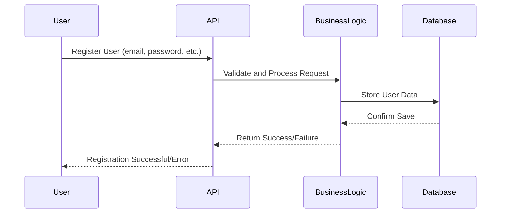
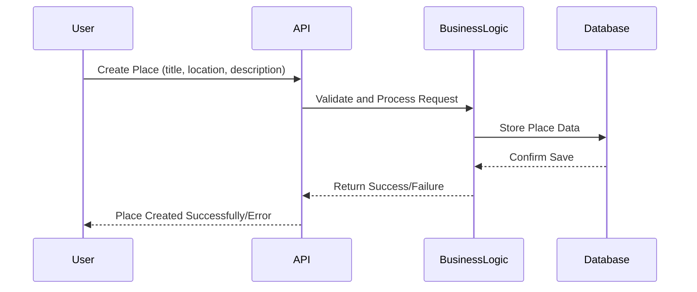
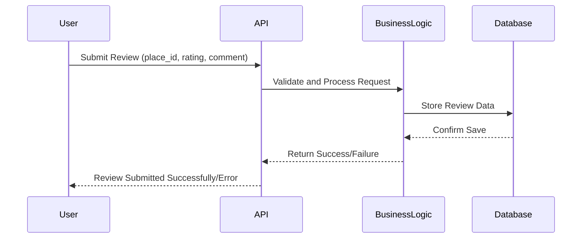
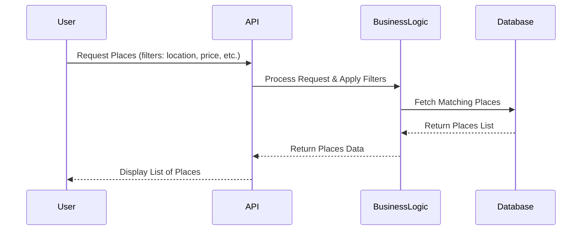

# Diagrammes de séquence pour les appels d'API

## Objective
Un diagramme de séquence pour les API Calls a pour objectif de modéliser la communication et l’enchaînement des interactions entre les différents composants d’un système (par exemple : User → API → Business Logic → Database) lors d’un appel à une API.

## API Calls

### 1. User Registration

## Explication
Ce diagramme de séquence montre le processus d’inscription d’un utilisateur (user registration flow) dans une application.
Il décrit les interactions entre quatre composants :
1. User (l’utilisateur)
2. API (l’interface qui reçoit la requête)
3. BusinessLogic (la couche métier qui gère la logique de validation et de traitement)
4. Database (la base de données où sont stockées les informations de l’utilisateur)

## 2. Place Creation

## Explication

### Les Auteurs
- User → l’utilisateur (par exemple, une personne qui crée un lieu dans une appli)
- API → l’interface qui reçoit les requêtes de l’utilisateur
- BusinessLogic → la partie du programme qui contient la logique métier (les règles de fonctionnement)
- Database → la base de données où les informations sont enregistrées

### Le Deroulement

1. User → API :
L’utilisateur envoie une demande pour créer un lieu (avec un titre, une localisation, une description).
2. API → BusinessLogic :
L’API transmet la requête à la logique métier pour la vérifier et la traiter.
3. BusinessLogic → Database :
La logique métier enregistre les données du lieu dans la base de données.
4. Database → BusinessLogic :
La base de données confirme que l’enregistrement s’est bien passé.
5. BusinessLogic → API :
La logique métier renvoie à l’API le résultat (succès ou échec).
6. API → User :
L’API informe l’utilisateur que le lieu a été créé avec succès (ou qu’il y a eu une erreur).

# 3. Review Submission

## Explication
Ce diagramme de séquence illustre le flux d’une requête de soumission d’avis utilisateur dans une architecture en couches (API, logique métier, base de données).

1. User → API
L’utilisateur envoie un avis via l’interface (ex. formulaire sur une app).
Paramètres envoyés : place_id, rating, comment.
2. API → BusinessLogic
L’API reçoit la requête et la transmet à la couche de logique métier pour validation et traitement.
3. BusinessLogic → Database
La logique métier stocke l’avis dans la base de données (après validation des données).
4. Database → BusinessLogic
La base confirme que l’enregistrement a réussi (ou échoué).
5. BusinessLogic → API
La logique métier retourne le résultat de l’opération (succès ou échec).
7. API → User
L’API informe l’utilisateur du résultat final :
Succès → “Review submitted successfully”
Erreur → “Error submitting review”

# 4. Fetching a List of Places

## Explication
Ce qui se passe, en langage simple :

1. L'utilisateur demande des lieux → Il envoie une recherche (ex : "je veux des lieux pas trop chers à Paris").
2. L’API reçoit la demande → Elle ne fait pas le travail elle-même, elle transmet.
3. La logique métier (BusinessLogic) analyse → Elle applique les filtres (prix, localisation...) et prépare une recherche propre.
4. La base de données cherche → Elle récupère tous les lieux qui correspondent à la demande.
5. La base renvoie les résultats → Elle renvoie la liste des lieux trouvés à la logique métier.
6. La logique métier renvoie à l’API → Elle renvoie les données prêtes à être affichées.
7. L’API affiche les résultats à l’utilisateur → L'utilisateur voit la liste des lieux à l'écran.

